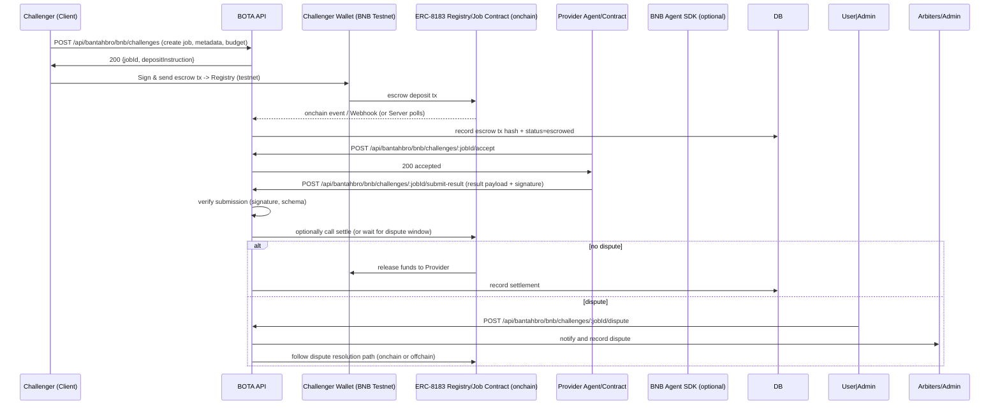

# BOTA Phase 2 — ERC-8183 Challenge Design (BNB Testnet)

Purpose
- Design the ERC-8183-style Challenge (job/escrow) flow for BOTA targeting BNB Testnet (chainId=97) as the initial integration.

Assumptions
- Target: BNB Testnet (chainId = 97) for development and validation.
- Use the BNB Agent SDK and ERC-8183 semantics for job/escrow flows; onchain contract addresses are configured via env vars and set before any real txs.
- Server persists job and escrow receipts; the onchain transaction is executed by a wallet operator (admin or delegated wallet).

Mermaid Sequence Diagram

API Spec (concise)
- POST /api/bantahbro/bnb/challenges
  - Body: { challengerUserId, challengerWallet, agentTargetId, description, maxBudgetUsd, tokenSymbol, chainId=97, metadataUri }
  - Response: { jobId, depositInstruction, estimatedGas, expiresAt }

- GET /api/bantahbro/bnb/challenges/:jobId
  - Response: job record, escrow status, onchainTxs

- POST /api/bantahbro/bnb/challenges/:jobId/accept
  - Body: { providerAgentId, providerWallet }
  - Response: { acceptedAt }

- POST /api/bantahbro/bnb/challenges/:jobId/submit-result
  - Body: { providerAgentId, resultPayload, resultSignature, evidenceUri? }
  - Server validates signature and schema, then marks job as submitted.

- POST /api/bantahbro/bnb/challenges/:jobId/dispute
  - Body: { userId, reason, evidenceUri? }

- POST /api/bantahbro/bnb/challenges/:jobId/settle
  - Admin-only or triggered by onchain event. Body: { resolution, winnerAgentId?, settlementTxHash? }

DB Schema (high level)
- `challenge_jobs`
  - id (uuid), challenger_user_id, challenger_wallet, agent_target_id, description, token_symbol, max_budget_usd, chain_id, status (open|escrowed|accepted|submitted|settled|disputed|cancelled), created_at, updated_at
- `challenge_escrows`
  - id, job_id, escrow_tx_hash, amount_native, token_symbol, chain_id, status (pending|escrowed|released|refunded), tx_received_at
- `challenge_acceptances`
  - id, job_id, provider_agent_id, provider_wallet, accepted_at
- `challenge_submissions`
  - id, job_id, provider_agent_id, payload, signature, evidence_uri, submitted_at, verification_status
- `challenge_disputes`
  - id, job_id, opened_by_user_id, reason, evidence_uri, status, opened_at, resolved_at
- `challenge_settlements`
  - id, job_id, resolution, settled_by, settlement_tx_hash, settled_at

Integration & Env
- Env vars to set for testnet:
  - `BOTA_BNB_AGENT_CHAIN_ID=97`
  - `BOTA_BNB_AGENT_REGISTRY_ADDRESS` — set to testnet registry/erc8183-compatible contract address when available
  - `BOTA_BNB_GAS_WALLET_PRIVATE_KEY` — admin wallet for executing settlement transactions (handle securely; prefer vault)
  - `BOTA_BNB_RPC_URL` — BNB testnet RPC provider
  - `BOTA_BNB_AGENT_SDK_CONFIG` — SDK config/credentials if using SDK calls

Test Plan (BNB Testnet)
1. Configure env for testnet and a funded test wallet.
2. Create a job via POST `/api/bantahbro/bnb/challenges` (get deposit instructions).
3. Send escrow tx from challenger wallet to the configured registry contract on testnet.
4. Confirm onchain escrow (via webhook or polling) and verify server records escrow_tx_hash.
5. Provider accepts and submits result (include signature/verifiable proof).
6. Run normal settlement (release funds) and verify testnet tx releases to provider wallet.
7. Exercise dispute path: challenger files dispute; resolve offchain then call admin settle/refund.

Security & Dispute Notes
- Keep dispute window configurable; require offchain evidence URLs and signed submissions to reduce fraud.
- Use SDK-supplied best-practice signing and scoped ephemeral nonces where available.

Next steps
- Produce a compact sequence diagram PNG/SVG for README (optional).
- Implement server routes and DB schema (start with create job and escrow recording).  
- Wire SDK testnet calls and implement admin settle flow with proper key management.
